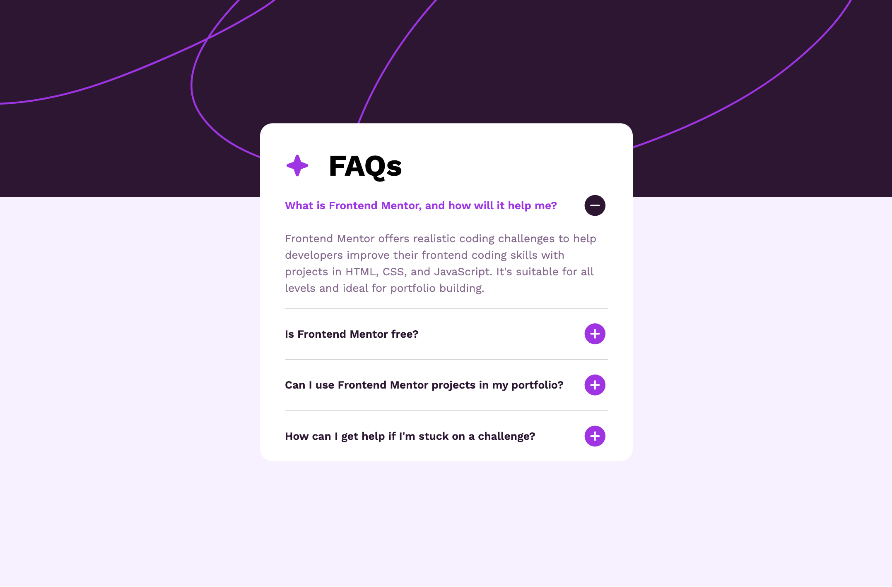
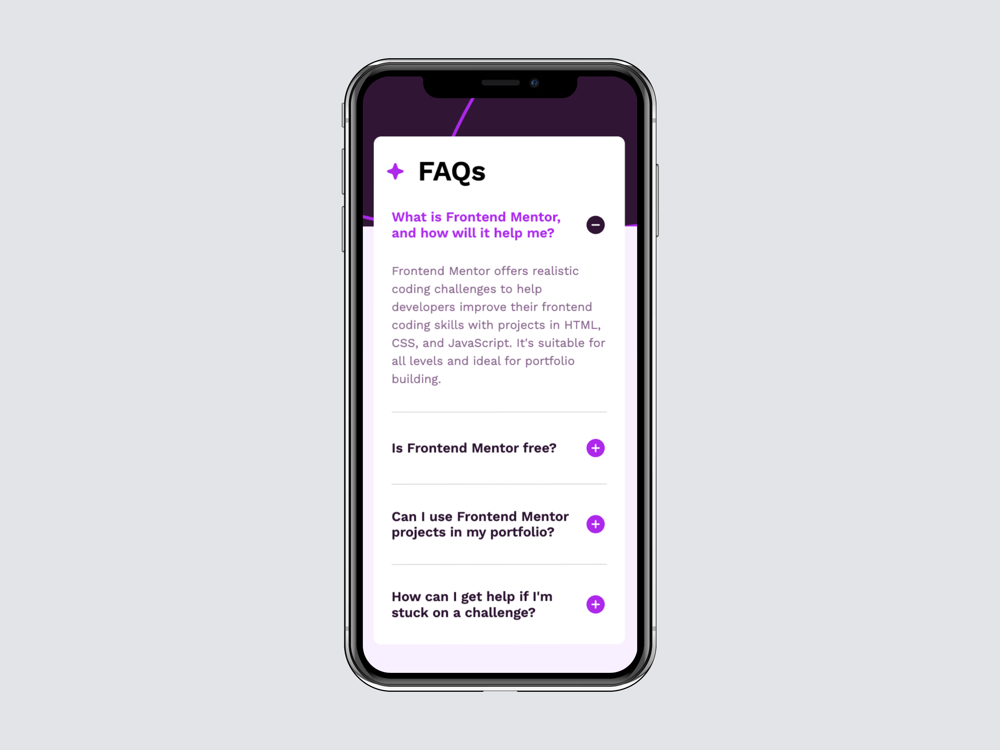

# Frontend Mentor - FAQ accordion solution

This is a solution to the [FAQ accordion challenge on Frontend Mentor](https://www.frontendmentor.io/challenges/faq-accordion-wyfFdeBwBz). Frontend Mentor challenges help you improve your coding skills by building realistic projects. 

## Table of contents

- [Overview](#overview)
  - [The challenge](#the-challenge)
  - [Screenshot](#screenshot)
  - [Links](#links)
- [My process](#my-process)
  - [Built with](#built-with)
  - [What I learned](#what-i-learned)
  - [Continued development](#continued-development)
  - [Useful resources](#useful-resources)
- [Author](#author)
- [Acknowledgments](#acknowledgments)

## Overview

### The challenge

Users should be able to:

- Hide/Show the answer to a question when the question is clicked
- Navigate the questions and hide/show answers using keyboard navigation alone
- View the optimal layout for the interface depending on their device's screen size
- See hover and focus states for all interactive elements on the page

### Screenshot

### Links

- Solution URL: [GitHub](https://github.com/svetikbaihe/FAQs-accordion.io.git)
- Live Site URL: [Vercel](https://faqs-accordion-io-git-main-svetas-projects-dd4a3c95.vercel.app/)

## My process

### Built with

- Semantic HTML5 markup
- SCSS/SASS
- Flexbox
- Mobile-first workflow
- OOP
- Vite(yarn)

### What I learned

This is my first time using SCSS, and I'm still struggling with JavaScript. If you look at the code, you can see that I'm preparing myself for future work with TypeScript and React.

### Continued Development

I spent a lot of time adjusting the background image across different screen sizes. Responsive design can be tricky, but I’ve done my best to meet the design requirements. 

### Useful resources

- [MDN](https://developer.mozilla.org/en-US/) - This resource always helps me to find solid checked information about HTML, CSS and JS. In this particular project I checked how to use focus while using a keyboard navigation.

## Author

- Frontend Mentor -
  [@svetikbaihe](https://www.frontendmentor.io/profile/svetikbaihe)

## Acknowledgments

- Kudos to my mentor - [@ArtemPapusha](https://github.com/ArtemPapusha)
